Sidebar Menu
============

File Options
------------

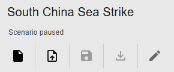

Scenarios are stored in a JSON file. You can create a new scenario or upload a scenario. Edit the scenario name using the Pencil icon.

Upon login with a google account, you can save a scenario to the cloud or download the scenario file.

Edit Scenario
-------------

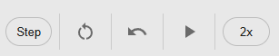

The playback section allows you to reset a scenario to the start, play and pause, step, and change playback speed. 

An undo button lets you undo an edit.

Recording
---------
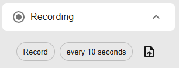

Recordings are different than scenarios because they track how a scenario played out over time. The recording button allows you to save a recording playback. Due to file sizes, the app will download multiple files of 10MB each. Toggle the scenario time step recording to decrease the file sizes.

Missions
--------
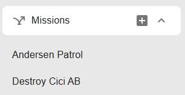

Missions allow you to create pre-planned routes for a set of aircraft. Strike missions and Patrol missions are currently supported. 

Note that missions are created for a specific Side.

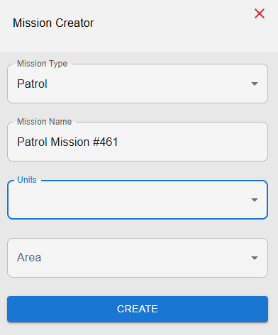

Patrol missions require Reference Points, creating a polygon. Add a reference from the top bar to create a polygon of the color of your mission. After selecting several units and the reference points, aircraft will patrol. 

Strike missions work similarly, but require a Target.

Note that aircraft must have loaded weapons to conduct a mission.

Layers
------

Different base maps can be cycled through.

Use the Layers button to turn off and on certain layers.
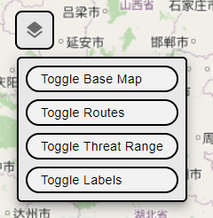

Top Bar Menu
============

Edit Buttons
------------

The top bar mainly allows you to add units. Aircraft, ships, SAMs, and reference points are supported. Pre-set air base locations are also supported

To create a custom air base, right click on the map.

The database button allows you to customize unit data. Do not upload classified information.

The message log records events and it allows you to debug what occured in your scenario.

Allies and Doctrine
-------------------

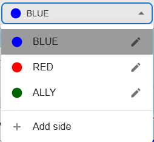

The dropdown menu allows you to create sides. Click the pencil icon to control allies and enemies. 

The doctrine menu allows you to choose the side's expected behavior. 

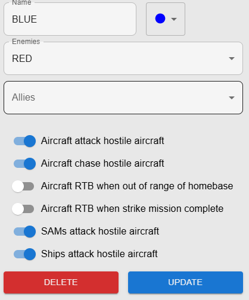

Unit Types
==========

Aircraft
--------

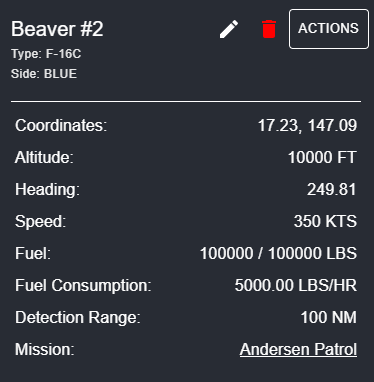

Clicking on a unit reveals a menu with editable characteristics. Click on the Pencil to edit this units characteristics. Note the importance of detection range in deciding Doctrine.

Click actions for the following 

- Plot Course: Travels in the direction of the course

- Manual Attack: open the weapons menu

- RTB: Returns to original base

- Duplicate: Creates a duplicate unit.

- Edit Location: Moves unit to a different location.

Weapons menu
------------

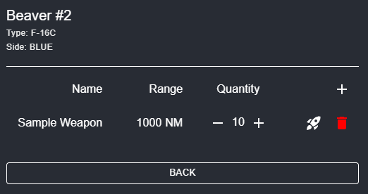

The weapons menu allows you to add weapons and launch a missile. Missiles are manually launched using the rocket icon.

Missiles can also be launched automatically in the Doctrine menu. 

SAMs
----
SAMs have coordinate locations, altitude, range, side, and weapon quantities. For a SAM, users can edit its name, type, range, and weapon quantity.

Ships (Under development)
-------------------------
Ships have have coordinate locations, speed, heading, aircraft quantity, and fuel for the ship.

For a ship, users can edit its name, type, speed, weapon quantity, current fuel, and range.

Users can launch aircraft from ships using the Launch Aircraft button.

Bases
-------------------------

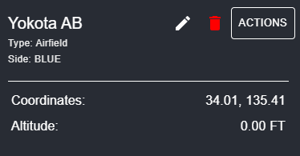

Airbases primarily house aircraft. An airbase has a coordinate location, altitude, side, and aircraft quantity. 

For an airbase, users can edit its name.

Actions allows you to add aircraft to the base.